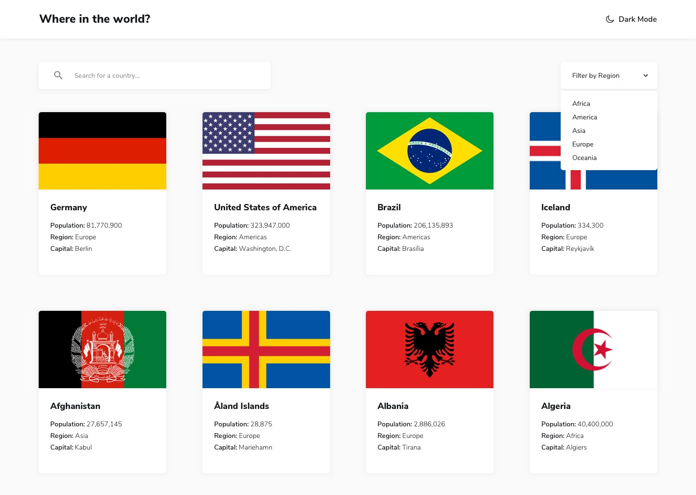
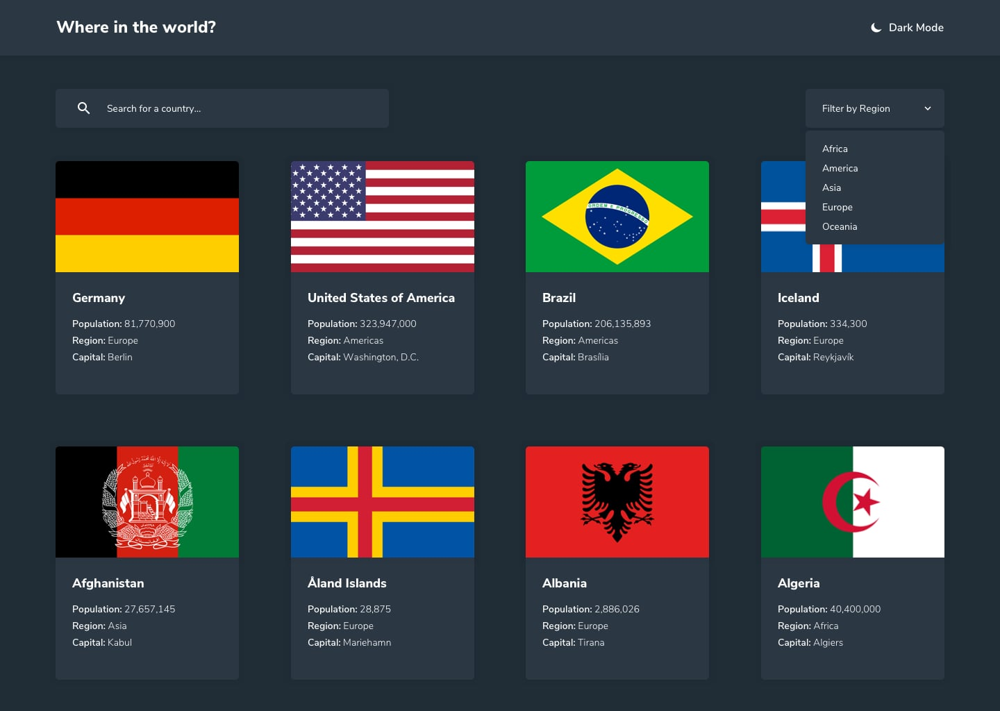
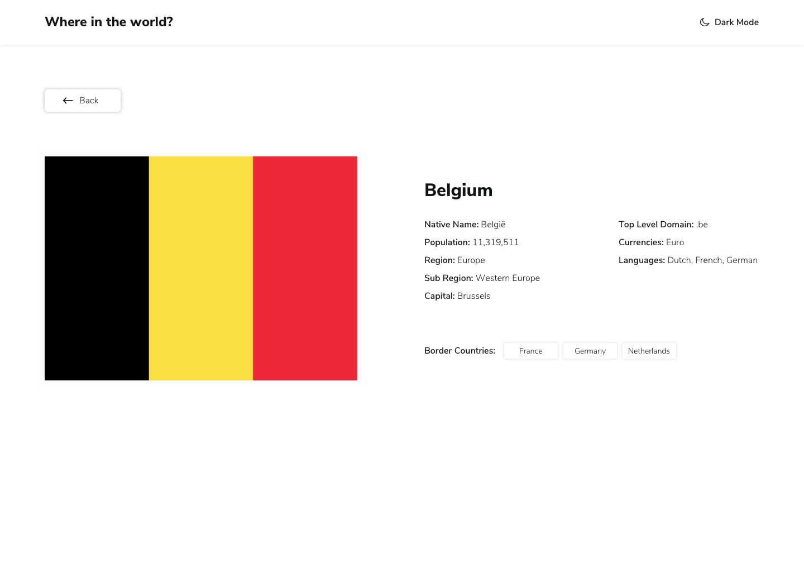
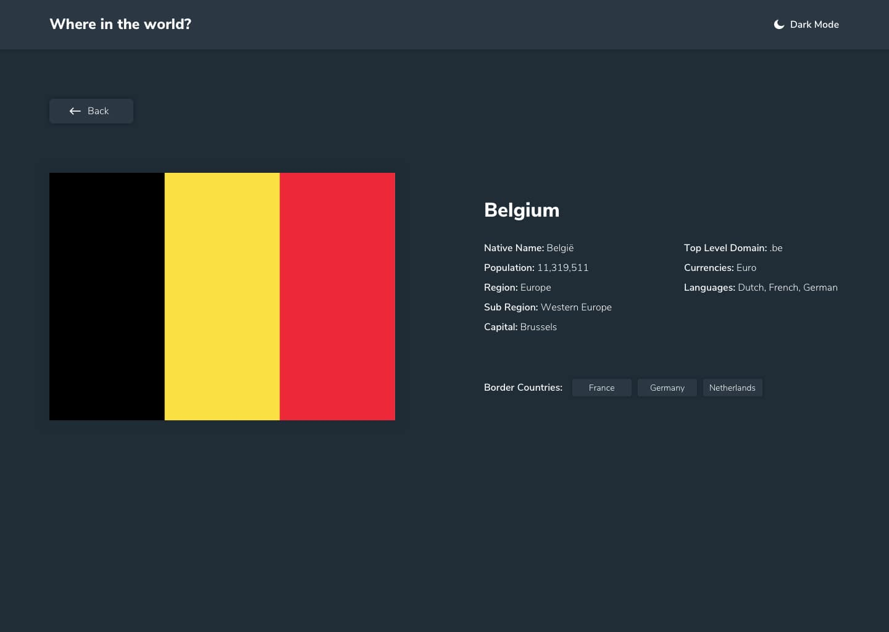
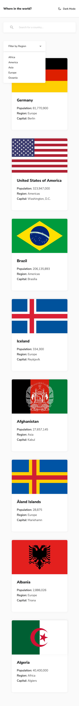

# REST Countries Explorer

A modern, responsive web application that displays comprehensive country data from the REST Countries API with advanced filtering, search, and theme switching capabilities.

## About the Project

REST Countries Explorer is a feature-rich web application that provides users with detailed information about countries worldwide. The application seamlessly integrates with the REST Countries API to fetch real-time data and includes a local fallback for offline functionality.

## Features

- **Country Browser**: View all countries in a responsive grid layout
- **Smart Search**: Real-time search with debounced input for country names
- **Region Filtering**: Filter countries by continent (Africa, Americas, Asia, Europe, Oceania)
- **Detailed Country Views**: Comprehensive information including population, capital, languages, currencies, and more
- **Border Navigation**: Click through to neighboring countries from detail pages
- **Dark/Light Theme**: Persistent theme switching with smooth transitions
- **Responsive Design**: Optimized for mobile (375px) to desktop (1440px)
- **Accessibility**: Full ARIA support, semantic HTML, and keyboard navigation
- **Error Handling**: Graceful fallback to local data when API is unavailable

## Technology Stack

### Frontend
- **HTML5**: Semantic markup with accessibility features
- **CSS3**: Modern CSS with custom properties, Grid, and Flexbox
- **Vanilla JavaScript**: ES6+ features, async/await, and modern APIs
- **Font Awesome**: Icon library for UI elements

### Design
- **Nunito Sans**: Google Font (300, 600, 800 weights)
- **CSS Custom Properties**: Dynamic theming system
- **Responsive Grid**: Mobile-first approach with breakpoints

### APIs & Data
- **REST Countries API**: Primary data source
- **Local JSON Fallback**: Offline functionality
- **Flag CDN**: High-resolution country flags

## Screenshots

### Light Mode - Homepage

### Dark Mode - Homepage

### Light Mode - Country Detail

### Dark Mode - Country Detail

### Mobile View

## 📄 License

This project is open source and available under the [MIT License](LICENSE).

## Contributing

Contributions, issues, and feature requests are welcome! Feel free to check the [Issues page]
---

Built with using modern web technologies
